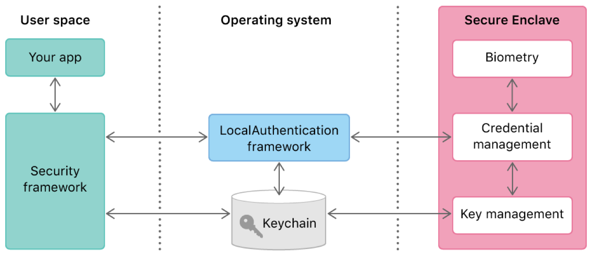

#  Accessing Keychain Items with Face ID or Touch ID

Protect a keychain item with biometric authentication.

## Overview

When you store a secure item like a password or a private key in the keychain, you dictate the conditions under which that item can be accessed later. Among other things, you can tell keychain services that every time it tries to read the item, it should first seek the user’s permission—for example, by authenticating the user biometrically with Face ID or Touch ID. You rely on both the Security and LocalAuthentication frameworks to enable this behavior. 



To access keychain items in general, you use keychain services within the Security framework. When authentication is needed, keychain services then relies on the LocalAuthentication framework to present the appropriate interface to the user. The Secure Enclave then carries out the authentication by, for example, testing the user’s finger against the stored fingerprints. The Secure Enclave passes back a pass/fail result that gates keychain item access. No user space or operating system software ever has access to the underlying authentication data, such as stored fingerprints.

This sample code project demonstrates how to configure a keychain item when you store it, so that when your app tries to retrieve it later, keychain services only provides the data after a successful user authentication event.

## Set the Face ID Usage Description

In any project that uses biometrics, include the [NSFaceIDUsageDescription](https://developer.apple.com/library/content/documentation/General/Reference/InfoPlistKeyReference/Articles/CocoaKeys.html#//apple_ref/doc/uid/TP40009251-SW75) key in your app’s `Info.plist` file. Without this key, the system won’t allow your app to use Face ID. The value for this key is a string that the system presents to the user the first time your app attempts to use Face ID. The string should clearly explain why your app needs access to this authentication mechanism. The system doesn’t require a comparable usage description for Touch ID.

## Create an Access Control

To create a protected keychain item, begin by creating a [SecAccessControl](https://developer.apple.com/documentation/security/secaccesscontrol) instance:

``` swift
let access = SecAccessControlCreateWithFlags(nil, // Use the default allocator.
                                             kSecAttrAccessibleWhenPasscodeSetThisDeviceOnly,
                                             .userPresence,
                                             nil) // Ignore any error.
```

The access control instance contains restrictions along two dimensions: accessibility and authentication. For the first, the [kSecAttrAccessibleWhenPasscodeSetThisDeviceOnly](https://developer.apple.com/documentation/security/ksecattraccessiblewhenpasscodesetthisdeviceonly) setting prevents items from being stored if the device has no passcode. Further, any item already stored in the keychain with this level of accessibility becomes unavailable if the user removes the passcode. Also, because this accessibility ends with `ThisDeviceOnly`, the item isn’t eligible for the iCloud keychain and won’t be included if the user restores a device backup to a new device. This is the most restrictive option, but others are available.

Along the authentication dimension, the above code uses the [userPresence](https://developer.apple.com/documentation/security/secaccesscontrolcreateflags/1392879-userpresence) flag. This tells keychain services to request biometric authentication, or to fall back on the device passcode, whenever the item is later read from the keychain. For more information about creating an access control instance, including the various levels of restrictiveness in each dimension, see [Restricting Keychain Item Accessibility](https://developer.apple.com/documentation/security/keychain_services/keychain_items/restricting_keychain_item_accessibility).

## Optionally, Provide a Customized Context

Keychain services automatically makes use of the LocalAuthentication framework, and in particular uses an [LAContext](https://developer.apple.com/documentation/localauthentication/lacontext) instance to authenticate the user. You can let keychain services create a new context every time it needs to authenticate. However, if you want to alter the default configuration, you can optionally create a context for it to use instead:

``` swift
let context = LAContext()
context.touchIDAuthenticationAllowableReuseDuration = 10
```

In this example, you set the context’s [touchIDAuthenticationAllowableReuseDuration](https://developer.apple.com/documentation/localauthentication/lacontext/1622329-touchidauthenticationallowablere) parameter to a non-zero value. As a result, any Touch ID authentication that keychain services requires is satisfied by the most recent device unlock event, if it happened within the given number of seconds (up to five minutes). This configuration prevents the user from having to authenticate twice in quick succession: once to get into the device, and immediately again to obtain a keychain item. Note that this grace period applies specifically to device unlock with Touch ID, not keychain retrieval authentications. 

## Add the Keychain Item

Next, put all of the attributes together into a query dictionary:

``` swift
let query: [String: Any] = [kSecClass as String: kSecClassInternetPassword,
                            kSecAttrAccount as String: account,
                            kSecAttrServer as String: server,
                            kSecAttrAccessControl as String: access as Any,
                            kSecUseAuthenticationContext as String: context,
                            kSecValueData as String: password]
```

This query is very much like the one described in [Adding a Password to the Keychain](https://developer.apple.com/documentation/security/keychain_services/keychain_items/adding_a_password_to_the_keychain), with the addition of the access control instance and the context. Then use this query to actually create the item:

``` swift
let status = SecItemAdd(query as CFDictionary, nil)
guard status == errSecSuccess else { throw KeychainError(status: status) }
```

Test the return status and handle error conditions in a way that makes sense for your app. For example, you might handle the [errSecDuplicateItem](https://developer.apple.com/documentation/security/errsecduplicateitem) error by attempting to modify the item that already exists. See [Using the Keychain to Manage User Secrets](https://developer.apple.com/documentation/security/keychain_services/keychain_items/using_the_keychain_to_manage_user_secrets) for a general discussion of working with keychain items.

## Provide a Prompt When Reading the Item

When reading the protected item, you search for it as described in [Searching for Keychain Items](https://developer.apple.com/documentation/security/keychain_services/keychain_items/searching_for_keychain_items). Keychain services works with LocalAuthentication to authenticate the user automatically as needed, using the context you provided, if any. However, there are a few additional query settings you might want to include.

First, you can provide a string that the authentication context presents to the user when asking for a TouchID event. Set this string in the [kSecUseOperationPrompt](https://developer.apple.com/documentation/security/ksecuseoperationprompt) attribute of the keychain item search query:

``` swift
let context = LAContext()
context.localizedReason = "Access your password on the keychain"
let query: [String: Any] = [kSecClass as String: kSecClassInternetPassword,
                            kSecAttrServer as String: server,
                            kSecMatchLimit as String: kSecMatchLimitOne,
                            kSecReturnAttributes as String: true,
                            kSecUseAuthenticationContext as String: context,
                            kSecReturnData as String: true]
```

Providing this prompt lets the user know why you want them to authenticate. The corresponding dialog already names your app, so you don’t have to include that in the prompt.

Additionally, if you don’t want keychain services to prompt for authentication when you search for items, for example, because you’re conducting a broad search and are willing to simply skip any protected items, you can specify the [kSecUseAuthenticationUI](https://developer.apple.com/documentation/security/ksecuseauthenticationui) value with the [kSecUseAuthenticationUISkip](https://developer.apple.com/documentation/security/ksecuseauthenticationuiskip) key.
